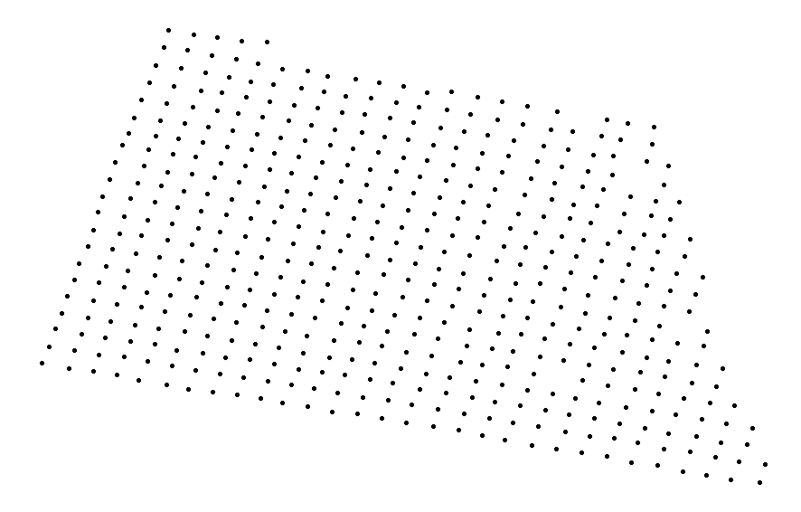
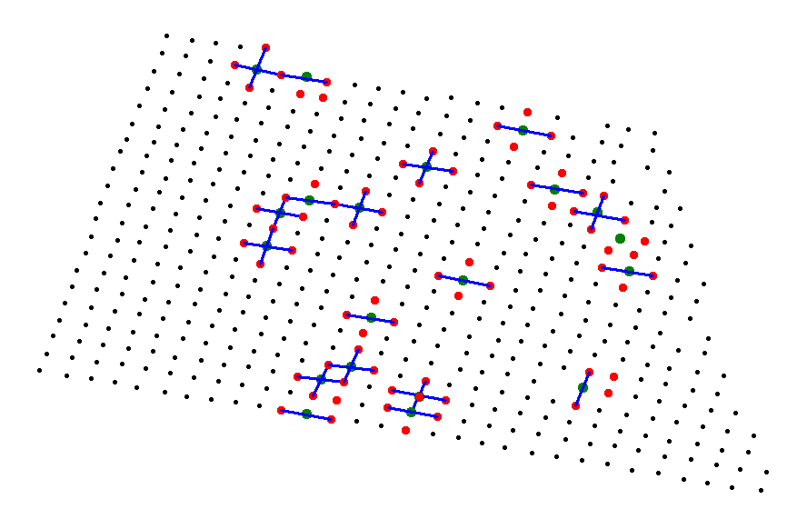
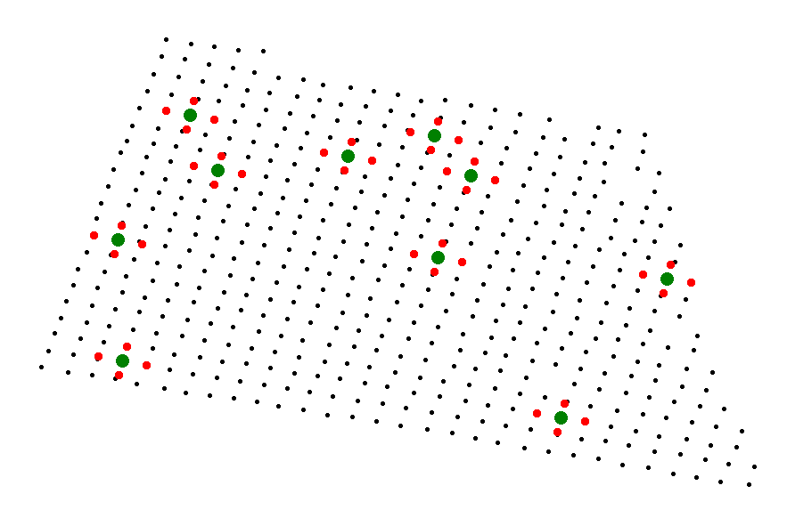
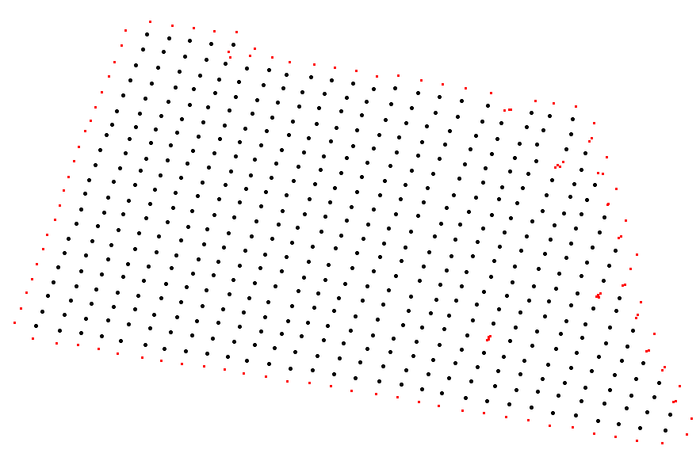
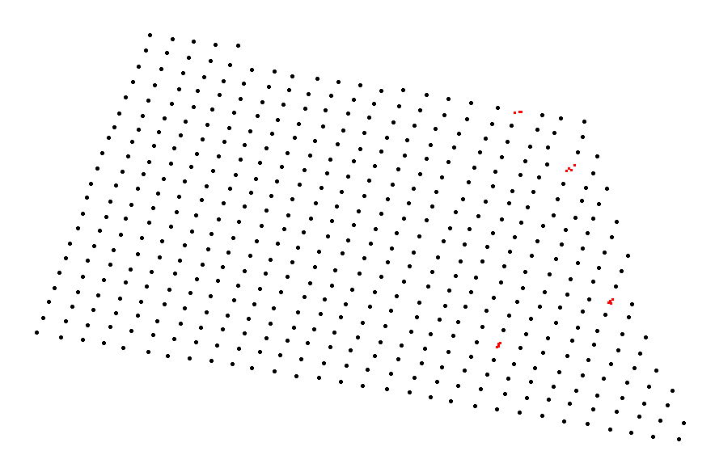
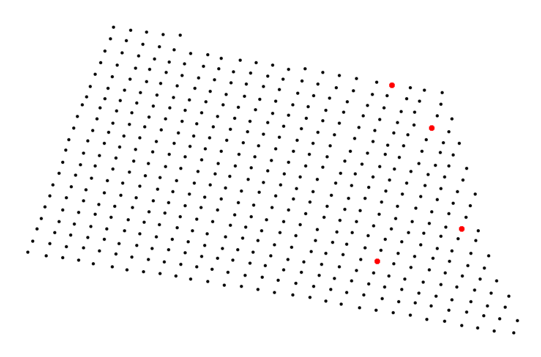
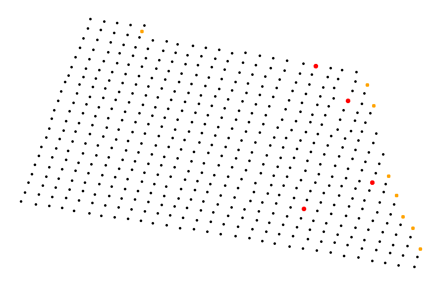

# Aerobotics Assessment

Author: Luke Neville

Date: 08/12/2023

_This content can be found at 146.190.160.117:8000/_

## Task

Set up a server that hosts an API. The API has a single path: https://<hostname>/orchards/{orchard_id}/missing-trees

When this API is queried, it fetches tree survey data from the Aerobotics API, and uses this data to 
determine where there are missing trees in the orchard. 

## Stack

This project is coded in Python, using FASTAPI and Uvicorn as the server. The app is containerised 
with Docker, and is deployed on a Digital Ocean droplet. Version control uses Git hosted on GitHub. 

## API usage
The API can be queried at: 
> 146.190.160.117:8000/orchards/216269/missing-trees

which gives the following response: 

> {"orchard_id":216269,"missing_trees":[{"lat":-32.328625375,"lng":18.8256626},{"lat":-32.3288017,"lng":18.826426125},{"lat":-32.32890035,"lng":18.825851},{"lat":-32.32867367287245,"lng":18.82666999238146}]}

## Algorithm

Given an orchard ID, the Aerobotics server is queried to fetch tree survey data. This contains the number of
trees in the orchard, and then a list of each tree's ID, Lat, Lng, and radius amongst other values.  

We can use this to plot each tree, to visualise the orchard:



The 'orchard features' are then extracted. These features are the angle of each row on each axis, as 
well as the average distance between each tree on each axis. 

To compute this, each tree is looked at in turn (below represented in a green dot). The four closest 
neighbour trees are then found (show in red dots). For each pair of neighbour trees, a line is drawn 
between them, and it is checked if the origional center tree is situated on that line. If it is, we
have found one of the major axes of the orchard. The angle/ slope of this line is stored, along with the 
average distance between the three trees on this line. This is done for every tree in the orchard. 
These are then seperated into two groups based on the gradient, giving one group for each major axis 
in the orchard. These are then averaged to find the average slope and tree spacing/ distance on each axis. a



Given we now know the layout features of this orchard, we can do a quick check to see whether our values are correct. 
Taking a random subset of the orchard, we plot where we expect each tree to be if it were planted using 
the orchard features we previously worked out. Below, we can see that we are roughly correct. 



We can now iterate over each tree in the orchard and check if there is a tree where we expect there to be one. 
This is done by finding the expected location and then searching in a N meter radius around this point 
and checking if we find a tree. If we do not, we store the location as a point where a tree is potentially missing. 
This gives the following set of points. 



We can only know for sure that a tree is missing if 3 or more neighbour trees expected there to be a 
tree in that locaation. We thus iterate over all these missing trees and only keep the points that are in a 
group of three or more. 



Finally, the midpoint of these missing tree groups is found, identifying the location of the missing trees. 



### Algorithm parameters

1) The precision that is used to check whether or not a tree falls on a line. 
  [Used value: 0.5m on either side of the line]
2) The precision that is used to check whether or not a tree exists in the radius of a location. 
  [Used value: 2.5m]
3) The precision that is used to determine the area that constitutes a group of trees
  [Used value: 2.5m]

### Extension

In interior corners of the orchard, such the the one shown below (where an 'X' is a tree) is is unknowable 
whether there should be a tree at position 0 - we simply do not know what the farmer intended. 

```
    X X X X
      0 X X   
        X X
```

By taking the groups of two potentially missing trees, we can also determine the _potentially_ missing 
trees. Here, the trees we can be sure are missing are shown in red, with the trees that we are unsure
if the farmer intends to be there or now, shown in orange.



In this case, the API could respond with these additional potentially missing trees. 

```
{
  'missing_trees': [{'lat': -32.328625375, 'lng': 18.8256626}, {'lat': -32.3288017, 'lng': 18.826426125}, {'lat': -32.32890035, 'lng': 18.825851}, {'lat': -32.32867367287245, 'lng': 18.82666999238146}], 
  'potentially_missing_trees': [{'lat': -32.32797479999999, 'lng': 18.8269149}, {'lat': -32.32888053061613, 'lng': 18.826539383170633}, {'lat': -32.32899673061614, 'lng': 18.825758933170633}, {'lat': -32.329023380616135, 'lng': 18.825607733170635}, {'lat': -32.32896423061614, 'lng': 18.825895583170634}, {'lat': -32.32909188061613, 'lng': 18.825382733170635}, {'lat': -32.32906303061613, 'lng': 18.825527933170633}, {'lat': -32.32890573061613, 'lng': 18.826390333170636}]
}
```

### Assumptions
1) There cant be three missing trees in a row
  Since the algorithm requires three adacent trees to be neighbours of the missing tree, an internal 
  row of three missing trees will find the two outer ones, but not the inner tree. 

```
    X X X       X X X
    X   X       X 0 X
    X   X   --> X   X
    X   X       X 0 X
    X X X       X X X
```

 Here, the 0's will be identified. To get around this, the algorithm can be run on a loop until no new
 missing trees are found, where the missing trees from the previous run are incorporated into the next run. 
 This will then identify all missing trees. 

 ```
    X X X       X X X
    X X X       X X X
    X   X   --> X 0 X  
    X X X       X X X
    X X X       X X X
```

Combined, these give the following after two runs, as expected

```
    X X X
    X 0 X
    X 0 X  
    X 0 X
    X X X
```

2) The orchard is planted in a grid pattern with the two major axes at roughly 90 degree angles to each other. 
3) The trees are spaced roughly equally along each axis (note that each axis does not have to have the same 
spacing, but the spacing must be consistent on each axis).

## Run:
* Create a .env file containing the Aerobotics API key and the hostname of the server
  ```
  API_KEY=XXXXXXXXXXXXXXXXXXXXXXXXXXXXXXXXXXXXXXXX
  HOSTNAME=<localhost | X.X.X.X> 
  ```
* ```> docker-compose up --build server ```